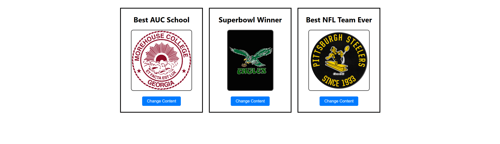

### React Parent-Child Components Project

This project demonstrates how to create a **React component** that renders at least **two child components**, allowing dynamic content changes via button clicks. The parent component manages state and passes data to the children, ensuring that each child can update its displayed content upon user interaction.

## **Features**

✔️ Renders a parent component (`App.js`) with two child components  
✔️ Each child component has:

- A **header** for text
- A **button** with an `onClick` event
- **Dynamic content** (images) that updates when clicked  
  ✔️ Clicking the button cycles through different images for each child component  
  ✔️ Uses **React state** to track and update child component content

---

### **Files Overview**

- **`App.js`** - The **parent component** that manages state and renders child components.
- **`ChildComponent.js`** - The **child component** that displays a header, an image, and a button.
- **`index.js`** - The **entry point** that renders the `App` component.
- **`App.css` & `index.css`** - Styling files to enhance UI.

---

## **How It Works**

### **Parent Component (`App.js`)**

- Manages the **state** for two child components:
  - `child1Image` (AUC school logos)
  - `child2Image` (NFL team logos)
  - `child3Image` (Best NFL Team)
- Handles **button clicks** to cycle through an array of images.

### **Child Component (`ChildComponent.js`)**

- Receives `header`, `image`, and `onChangeContent` props from the parent.
- Displays an **image** and a **button** that triggers an event in the parent.
- The **parent updates state**, which re-renders the child with a new image.

---

## **Installation & Setup**

1. Clone this repository:

   ````sh
   git clone https://github.com/your-username/react-parent-child-demo.git
   cd react-parent-child-demo

2. **Navigate to the Project Folder**:

   ```bash
   cd your-repo-name
   ````

2. **Install Dependencies**:

   ```bash
   npm install
   ```

3. **Start the Development Server**:

   ```bash
   npm start
   ```

4. **Open the Application**:
   ```bash
   The app will open automatically in your browser at http://localhost:3000
   If it doesnt, manually navigate to http://localhost:3000
   ```

## Application Screenshot


